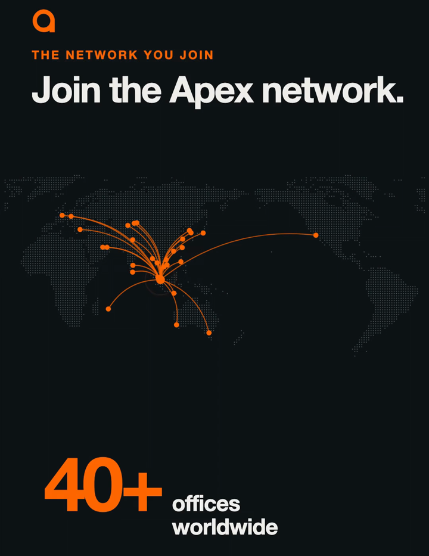

# AGC franchise video

A vertical launch film for the Apex Global Center franchise, built in code with [Remotion](https://www.remotion.dev) by Claude Code, from the brand of the rebuilt Apex Global Center website. Built in public by [Sahi](https://github.com/Sahiii-i).

It is also a test of two Claude Code skills for making launch videos:

- **[product-film](https://github.com/Rieranthony/product-film-skill)**: interview, a brand file, a beat sheet on a measured music grid, style frames, stills review, a 240 fps master with motion blur, decoded checks on the final files. Used for the main film.
- **[brag](https://github.com/latent-spaces/brag)**, which hands off to `/brag-slim` on Opus 5.5: a 20 second teaser with share copy and a poster baked into frame 0.



## The film (v2, 59 s, 9:16)

| Bars | Scene |
|---|---|
| 1 to 3 | Hook: "Own an education business." "High quality & extremely affordable education." |
| 4 and 5 | Real class footage: trainers come from Apex HQ, you run the business |
| 6 and 7 | On the drop: "Open an Apex Global Center in your city." |
| 8 to 10 | A dotted world map: arcs from Singapore HQ to 40+ offices while the camera pulls back |
| 11 and 12 | 50,000+ students on the online platform, over a scrolling wall of certificate photos |
| 13 and 14 | Programs from partner institutions |
| 15 to 20 | The 90-day launch programme, month by month |
| 21 to 23 | Four franchise tiers, from district to HQ |
| 24 to 26 | Graduation montage, then "Support from day one." |
| 27 to 29 | Meet us at VIFS 2026, Ho Chi Minh City, 29 to 31 October |

The full beat sheet is in [`videos/franchise-prompt.md`](videos/franchise-prompt.md) and the look and claims rules in [`videos/BRAND.md`](videos/BRAND.md). The brag teaser's plan is in [`brag-output/brag-plan.md`](brag-output/brag-plan.md).

## How it is built

- `src/film/`: the main film. `cues.ts` is the beat sheet as data (every moment is a bar and beat on the measured 118 BPM grid), `Film.tsx` holds the scenes, `Network.tsx` the world map.
- `src/brag/`: the 20 s teaser.
- `src/shared/`: the Apex Editorial tokens, the mark that draws itself, word-by-word text, footage and sound helpers.
- `src/kit/`: time grid, closed-form springs, camera and magic-move helpers from the product-film skill.
- `scripts/make-map.mjs`: builds the dotted world map from Natural Earth data, centred on 150°E so no arc from Singapore crosses the map's edge.
- `scripts/beats.py`, `audio-edit.py`: measure the song's beat grid and cut it on bars. `stills.ts`, `render.ts`, `verify.py`: review stills, the 240 fps motion-blur render, and decoded checks of the finished files.

Every frame is a pure function of time: no CSS transitions, timers or state.

## Running it

The music, event footage, student photos and partner logos are not in this repository (licensing and privacy), so a fresh clone renders with gaps. To run it with your own assets:

```bash
npm install
node scripts/make-map.mjs
npx remotion studio src/index.ts
```

Put a track in `public/audio/`, measure it with `uv run --with numpy --with imageio-ffmpeg python3 scripts/beats.py --drums public/audio/<track>.mp3 --out public/audio/<track>.beats.json`, cut it with `scripts/audio-edit.py src/film/edit.json`, and render with `npx bun scripts/render.ts FranchiseFilm <name> --duration 58.981`.

Remotion has its own licence: free for individuals and small teams, a company licence above that. See [remotion.dev/license](https://www.remotion.dev/license).

## Credits

See [THIRD_PARTY_NOTICES.md](THIRD_PARTY_NOTICES.md). Code in this repository is MIT; the Apex Global Center name and mark are not.
